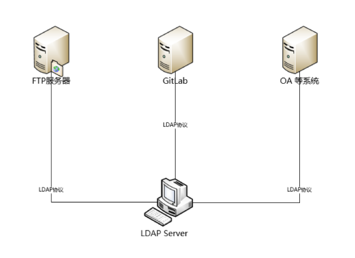

---
---

# LDAP

>Lightweight Directory Access Protocol  
>轻量目录访问协议

## 背景

### X.500

`目录服务（Directory Services）`是一种信息存储和检索系统  
可用于存储、组织和提供有关网络资源和对象的信息  
这些资源和对象可以包括用户、组织、设备和应用程序等

可以简单理解为文件夹式的数据库

`X.500`是一组由国际电信联盟（ITU-T）制定的标准  
是一套用于描述目录服务的框架  
最初规划出来是为了在分布式计算环境中提供一种标准化的、全局可访问的目录服务  
解决跨组织和地域的信息查询和服务定位问题  
常用于用户身份验证、权限管理、电子邮件地址簿、网络资源定位等场景  
定位有点像[OSI之于TCP/IP](../计算机基础/计算机网络/@序言.md#网络协议簇)一样，是一个仅供参考的模型

`X.500`标准系列定义了以下几个主要组件：

+ `目录信息树（Directory Information Tree, DIT）`：目录服务的数据结构，像[树](../计算机基础/数据结构/1.树.md)一样，规定了数据在目录服务中该如何存储
  + 通过`目录条目（Directory Entries）`表示对象
  + 这些条目包含`属性（Attributes）`和相应的值，比如`organization: Microsoft`
  + 每个条目具有一个唯一的`专有名称（Distinguished Name, DN）`，用于唯一标识目录中的对象。
+ `目录访问协议（Directory Access Protocol, DAP）`：定义了客户端如何与目录服务进行通信以访问、查询和修改目录数据的协议。DAP 是一个复杂的协议，基于 OSI（开放系统互联）的通信模型。
+ `目录系统代理（Directory System Agent, DSA）`：定义了目录服务器之间如何相互通信以交换和同步数据的协议。
+ `目录用户代理（Directory User Agent, DUA）`：用户与目录服务通信的客户端软件。

## 定义

`LDAP`是`X.500`标准系列中的一个子集，是一种`X.500`的简化版本

+ LDAP能干什么？
  + 
+ LDAP中的数据结构是怎样的？
  + 

## 概念

+ `模式（Schema）`：目录中的数据结构声明，有点类似于头文件
  + `对象类型（objectClass）`：目录中条目的类型声明
  + `属性类型（AttributeType）`：条目中属性的类型声明
    + [`LDAP OID Reference Guide`](https://ldap.com/ldap-oid-reference-guide/)
+ `条目（Entry)`：目录中的对象，相当于树的节点，可以有多种类型
  + `专有名称（Distinguished Name, DN）`：条目的唯一标识，每个对象都有一个唯一的名称，如`uid=tom,ou=market,dc=example,dc=com`，在一个目录树中`dn`总是惟一的
  + `相对辨别名（Relative Distinguished Name, RDN）`：条目的相对名称，相当于相对路径，是`dn`的一部分
  + `属性（Attribute）`：对象的各种属性，每个属性对应一种属性类型和多个值
    + 常用属性
      + `dc`：域组件（Domain Component），用于表示域名的一部分，如`dc=example,dc=com`
      + `cn`：通用名称（Common Name）
      + `ou`：组织单位（Organizational Unit）
      + `o`：组织（Organization）
      + `uid`：用户ID（User ID）
      + ...

## 软件

>要知道，LDAP只是一个协议，具体的软件有很多种  
>服务端通常使用两个标准端口号：
>
>+ 非安全 LDAP（明文传输）：默认端口号为 389  
>+ 安全 LDAP 或 LDAPS（通过SSL/TLS加密的LDAP）：默认端口号为 636

+ 服务端
  + `openldap-servers`：开源的实现 LDAP 协议的软件，`OpenLDAP`几乎是最主流的LDAP服务端软件
  + `UnboundID`：是一个用Java编写的LDAP软件开发工具包，主要是跟Spring LDAP开发有关
  + `ActiveDirectory`、`Domino Directory`、`WebSphere`

+ 客户端
  + `openldap-clients`，`OpenLDAP`的命令行工具
  + [`LDAP Account Manager（LAM）`](https://www.ldap-account-manager.org/lamcms/)：功能完善，中文友好，依赖php的web管理界面

[我花了一个五一终于搞懂了OpenLDAP](https://segmentfault.com/a/1190000014683418)

## 使用

### openldap-clients

| Option | 说明                                                               |
| ------ | ------------------------------------------------------------------ |
| -H     | ldapuri，格式为ldap://机器名或者IP:端口号，不能与-h和-p同时使用    |
| -h     | LDAP服务器IP或者可解析的hostname，与-p可结合使用，不能与-H同时使用 |
| -p     | LDAP服务器端口号，与-h可结合使用，不能与-H同时使用                 |
| -x     | 使用简单认证方式                                                   |
| -D     | 所绑定的服务器的DN                                                 |
| -w     | 绑定DN的密码，与-W二者选一                                         |
| -W     | 不输入密码，会交互式的提示用户输入密码，与-w二者选一               |
| -c     | 出错后忽略当前错误继续执行，缺省情况下遇到错误即终止               |
| -n     | 模拟操作但并不实际执行，用于验证，常与-v一同使用进行问题定位       |
| -v     | 显示详细信息                                                       |
| -d     | 显示debug信息，可设定级别                                          |
| -e     | 设置客户端证书                                                     |
| -E     | 设置客户端私钥                                                     |

### 权限控制

[Linux 安装并配置 OpenLDAP 新编（5）访问控制](https://blog.csdn.net/bashenandi/article/details/124602455)

WIP...
