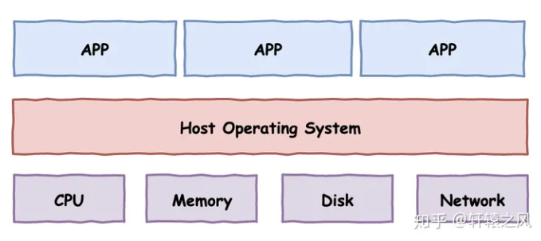
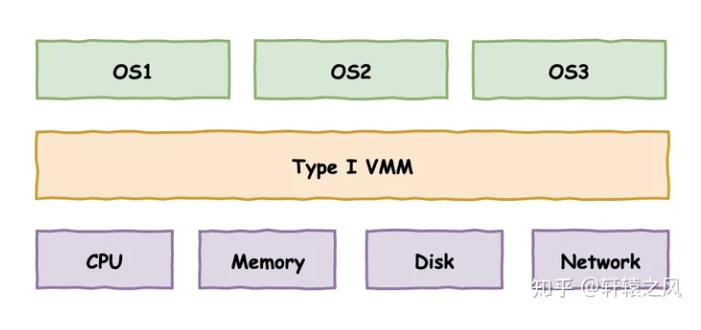
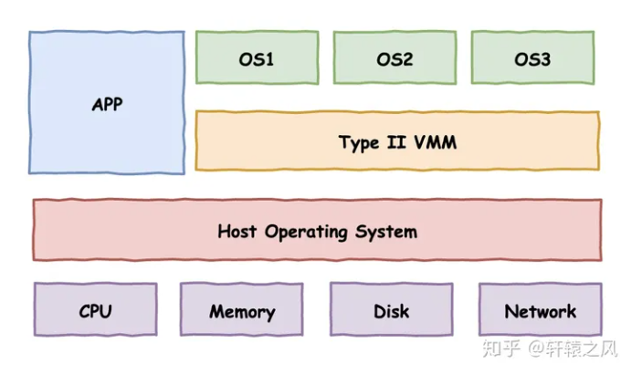

---
---

# 虚拟化

> **Virtualization**  

## 定义

将计算机的各种实体资源（如计算、存储、网络等）  
通过软件技术进行抽象、转换、封装  
使用户可以感知不到底层物理设备的存在  
从而创造出一套全新的虚拟计算资源。

## 分类

+ 按虚拟对象
  + 存储虚拟化：将存储设备抽象为一个统一的存储池
    + 如LVM
  + GPU虚拟化：将GPU资源抽象为多个虚拟GPU
    + 如NVIDIA vGPU
  + 网络虚拟化：将网络设备抽象为一个虚拟网络
    + 如Open vSwitch
  + ...
+ 按抽象程度
  + 硬件级虚拟化：在硬件上直接运行多个系统实例
    + 即裸金属虚拟化、`Type I`型虚拟化
    + 如KVM、ESXi，PVE
  + 操作系统级虚拟化：在单一操作系统上创建容器
    + 如Docker、LXC
  + 函数级虚拟化：虚拟化运行时环境  
    + 如Wine
  + 进程级虚拟化：共享内核的独立进程
    + 如JVM

## 技术

### 背景

首先，一台计算机可以被简单地划分为三层：

1. 硬件层
2. 操作系统层
3. 应用程序层

虚拟化有三个基本条件：

+ `等价性`：程序在本地计算机执行和在虚拟机中执行应该表现出一样的结果
+ `安全性`：虚拟机彼此隔离，与宿主计算机隔离
+ `性能`：绝大多数情况下虚拟机中的代码指令应该直接在物理CPU中执行，少部分特殊指令可由VMM参与
  + `VMM（Virtual Machine Monitor）`：虚拟机监控程序，又名`HyperVisor`

### 方案

+ `Type I`：直接凌驾于硬件之上，构建出多个隔离的操作系统环境
  + 
+ `Type II`：依赖于宿主操作系统，在其上构建出多个隔离的操作系统环境
  + 

如何实现？

`陷阱 & 模拟`：正常情况下直接把虚拟机中的代码指令放到物理的CPU上去执行，一旦执行到一些敏感指令，就触发异常，控制流程交给VMM，由VMM来进行对应的处理，以此来营造出一个虚拟的计算机环境

### 实现

#### 全虚拟化

#### 半虚拟化

#### 硬件辅助虚拟化

#### 容器
