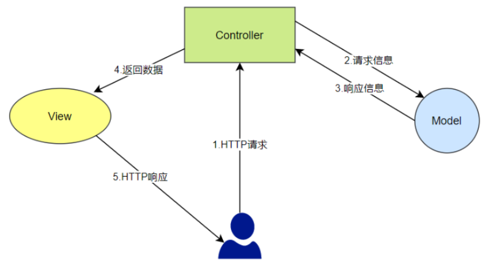

---
---

# SpringBoot

[SpringBoot官网](https://spring.io)

>最流行的Web后端框架（不仅限于Web应用），基于Spring  
>在Spring上引入了“[约定优于配置](../../../其他/编程概念#约定优于配置)”的理念，简化了配置过程  
>它包含了默认配置，并且提供了Starters（启动器），这些starter会自动导入项目所需的依赖集  
>开发者可以通过添加少量的配置属性来覆盖默认配置，而不是从零开始编写所有配置  
>内置了嵌入式的Servlet容器，程序可以被打包成可执行的JAR直接运行，无需额外的部署步骤

## 安装

以Gradle为例

```groovy
plugins {
    id 'java'
    id 'org.springframework.boot' version '3.1.5'
    id 'io.spring.dependency-management' version '1.1.3'
}

dependencies {
    implementation 'org.springframework.boot:spring-boot-starter-web'
    implementation 'org.springframework.boot:spring-boot-starter-data-jpa'
    testImplementation 'org.springframework.boot:spring-boot-starter-test'
    developmentOnly 'org.springframework.boot:spring-boot-devtools'
    ...
    // 需要什么库就引入什么库
}
```

也可以使用[Spring Initializr](https://start.spring.io)来生成项目框架

## 项目结构

```txt
├── ...                                 // 构建工具、证书、README等
│  
└── src
    ├── main
    │   ├── java
    │   │   └── net
    │   │       └── example
    │   │           └── Example.java
    │   │ 
    │   └── resources
    │       ├── templates               // 视图模板
    │       ├── static                  // 静态资源
    │       └── application.properties  // SpringBoot的配置文件
    │         
    └── test
        └── java
            └── net
                └── example
                    └── ExampleTest.java
```

## 概念

### MVC框架

>Model-View-Controller  
>模型-视图-控制器



Spring使用的Web框架是Spring MVC，逻辑如图  

简单来说MVC的功能分别是：

+ `模型`：直接与后面的数据交互
+ `视图`：就是用户直接看到的部分
+ `控制器`：处理请求

这里有两种情况：

+ `前后分离`：前端和后端分别独立开发，通过API进行交互，视图由前端渲染
+ `前后不分离` ：前端和后端一起开发，后端直接返回HTML，视图由后端渲染

## 启动

使用[Spring Initializr](https://start.spring.io)生成好项目框架后会有这么一个主类

```java
@SpringBootApplication // SpringBoot项目的主类必须带这个注解
public class DemoApplication {

    public static void main(String[] args) {
        SpringApplication.run(DemoApplication.class, args);
    }

}
```

先别去管他

新建一个Controller类（前提是必须有spring-boot-starter-web依赖）

```java
@RestController
public class ControllerDemo {
    @GetMapping("/")
    public String index() {
        return "index";
    }
}
```

然后直接点gradle的`bootRun`任务，访问`http://localhost:8080/`就可以看到`index`了
