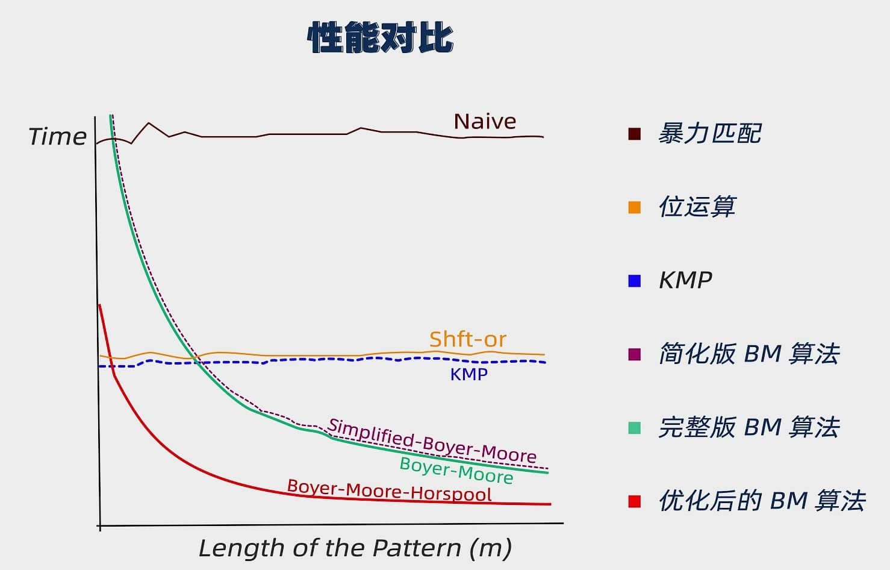

---
---

# 字符串搜索

## 目的

有两字符串，`模式串（pattern）`和`文本串（text）`  
要求在文本串中找到模式串的位置

## 性能对比

>图中`Shit-or`又叫`Bitap`  
>`Naive`实际上是`Brute-Force`

| 算法  | 时间复杂度(平均) | 时间复杂度(最坏) | 时间复杂度(最好) | 空间复杂度 | 稳定性 | 复杂性 |
| ----- | ---------------- | ---------------- | ---------------- | ---------- | ------ | ------ |
| BF    | $O(mn)$          | $O(mn)$          | $O(n)$           | $O(1)$     | 稳定   | 简单   |
| Bitap | $O(mn)$          | $O(mn)$          | $O(n)$           | $O(m)$     | 稳定   | 中等   |
| KMP   | $O(n+m)$         | $O(n+m)$         | $O(n)$           | $O(m)$     | 稳定   | 中等   |
| BM    | $O(\frac{n}{m})$ | $O(mn)$          | $O(n)$           | $O(m)$     | 稳定   | 较高   |
