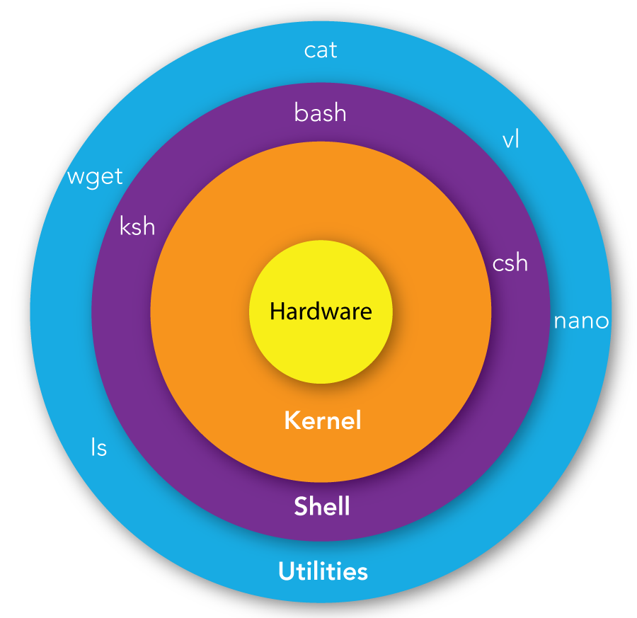

---
---

# Shell

>壳  
>Unix命令解释器  
>文件名后缀为`.sh`

## Unix 架构



+ `硬件（Hardware）`：CPU、内存、硬盘、键盘、鼠标、显示器等
+ `内核（Kernel）`：操作系统的核心部分，提供基本服务，例如进程调度和内存管理
+ `Shell`：命令解释器，提供用户界面
+ `Utilities`：基本的命令行程序，例如`ls`、`grep`
  + 第四层也可以是用户级的`应用程序（Application）`，例如`vi`、`Firefox`

## Shebang

>脚本文件的第一行中的特殊字符序列`#!`

`#!`后面跟着一个解释器的绝对路径，用来指定用哪个解释器来执行脚本文件

bash是最常见的Linux Shell

```shell
#!/bin/bash
# 使用bash作为解释器
echo hello
```

+ 默认使用当前的shell解释脚本(即:`$SHELL`环境变量)
+ 解释器路径必须用绝对路径，它不会自动去`$PATH`环境变量中寻找解释器
+ 若指定的解释程序不存在，就会报错找不到那个目录或文件
+ 若指定的解释程序不是可执行文件，那么该解释程序会被忽略,脚本转交给当前shell执行
+ 执行脚本时，脚本的文件名以及脚本的启动参数会一起作为参数传递给指定解释程序执行
+ 指定的解释程序没有可执行权限会报错，提示权限被拒绝
+ 脚本文件必须要有可执行权限，脚本才会被执行
+ 在执行脚本时直接使用`bash test.sh`这样的命令指定解释器，脚本中Shebang所在的一行将被自动忽略
