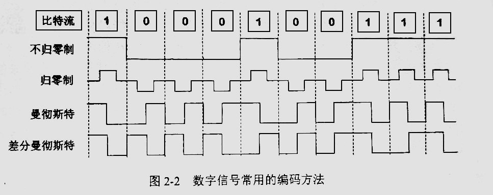

---
---

# 物理层

## 通用名词

+ 特性
  + `机械特性`：接口形状、引脚数目、引脚排列
  + `电气特性`：电压、电流、时序
  + `功能特性`：数据速率，编码方式，比特同步
  + `过程特性`：建立连接、维持连接、释放连接
+ `信号`：用来传递信息的某种符号、形式或者事件
  + 种类
    + `模拟信号`：连续变化的信号
    + `数字信号`：离散的信号
  + `码元`：信号的基本单位，一个固定时长的物理信号事件，用于代表一种或多种离散数值
    + 想象一下你有一盒彩色蜡笔，每种颜色都代表一句不同的话。当你要给朋友传递一句话时，你就选择一根对应颜色的蜡笔递给他。此时颜色就是码元
  + `信道`：信号传输的媒介
    + `单向`：单向传输
    + `双向`：双向传输
    + `半双工`：双向传输，但是不能同时传输
    + `全双工`：双向传输，可以同时传输

## 编码方式

:::caution

\*\***此处是临时信息**\*\*

+ `物理层编码`：将信息转换为数字信号的方式

:::

## 介质

## 组成

## 通信技术

### 信道复用

### 数据传输方式

## 顺便说说

### PCM

>**Pulse Code Modulation**  
>脉冲编码调制
