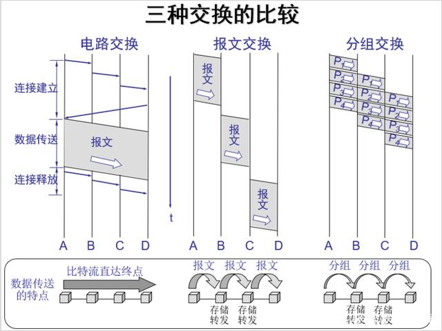
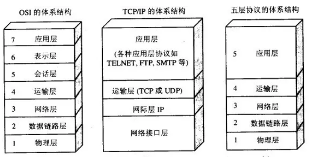
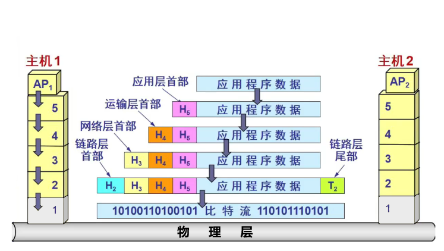
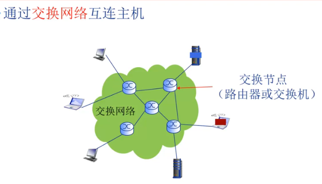
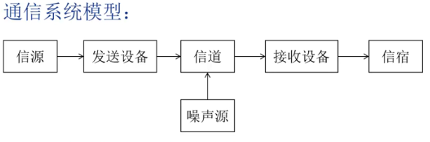

---
---

# 计算机网络

>**Computer Network**  
>互连的、自治的计算机集合

教科书上的定义已无法用混乱来形容……

## 通用名词

+ `自治`：无主从关系
+ `互连`：互联互通，从物理层面上能从任意一台计算机到达任意一台计算机

+ `复用`：同时在单一的通信信道或资源上传输多个信号或数据流
+ `分用`：从单一的通信信道中提取或恢复原始的多个信号或数据流

+ `互联网（Internet）`：全球最大的计算机网络
  + `ISP`：Internet Service Provider，互联网服务提供商

## 组成

+ 偏软硬构成
  + `计算设备`：主机、应用
  + `网络设备`：路由器、交换机等
  + `通信链路`：光纤、铜缆等
+ 偏设计思维
  + `网络边缘`：计算设备
    + `C/S`：客户/服务器(Client/Server)模型
      + 客户端发送请求，接收服务端响应
    + `P2P`：对等/点对点(Peer-to-Peer)模型
      + 不依赖专用服务器
      + 通信在对等实体间进行
  + `网络核心`：网络设备
    + `路由器`：工作在网络层，负责转发分组
      + `路由（Routing）`：确定信息从源到目标的传输路径
      + `转发（Forwarding）`：将信息从路由器的输入端口交换到的输出端口
    + `交换机`：工作在链路层，负责转发帧
      + `帧（Frame）`：数据链路层的数据单元
      + `交换(Switching)`：将帧从一个端口复制到另一个端口
        + `电路交换（Circuit Switching）`：独占一条链路进行数据传输
          + `电路（Circuit）`：通信线路，数据通信的基本单位
        + `报文交换（Message Switching）`：将数据以报文为单位进行传输
          + `报文（Message）`：数据报，单次通信的信息
        + `分组交换（Packet Switching）`：将报文分成分组进行传输
          + `分组（Packet）`：数据包，单次通信的信息的一部分
        + 三种交换比较：  
        
  + `接入网络`：通信链路，将边缘接入核心的的途径
    + `数字用户线路（DSL）`：利用电话线传输数据
    + `电缆网络（Cable Modem）`：利用有线电视网络传输数据
    + `以太网（Ethernet）`
    + `无线（Wireless）`
      + `无线局域网（LANs）`
      + `无线广域网（WANs）`

## 协议

>**Protocol**  
>事先约定好的数据交换规则

### 它规定了信息的

+ `语法`：数据与控制信息的结构或格式
+ `语义`：数据的意义，即需要发出什么控制信息、完成什么动作以及做出什么响应
+ `时序（同步）`：顺序

### 网络协议簇

>一大堆网络协议  
>层层抽象

#### 体系结构

+ `OSI（Open System Interconnect）`：爆金币的老东西，参考标准，七层
  + `应用层`：为应用程序提供网络服务
    + `HTTP`、`FTP`、`SMTP`、`POP3`、`IMAP`、`Telnet`、`SNMP`
  + `表示层`：数据格式转换、加密解密
    + `ASN.1`、`MIME`
  + `会话层`：建立、管理和终止会话
    + `NetBIOS`、`RPC`
  + `传输层`：提供端到端的数据传输服务
    + `TCP`、`UDP`
  + `网络层`：传输`分组（Packet）`，负责路由选择和逻辑寻址
    + `IP`、`ICMP`、`IGMP`
  + `数据链路层`：传输`帧（Frame）`，物理寻址、错误检测和纠正
    + `Ethernet`、`PPP`、`HDLC`
  + `物理层`：传输`比特（Bit）`流，定义物理媒介的传输方式
    + `EIA/TIA-232`、`V.35`、`USB`、`Bluetooth`
+ `TCP/IP（Transmission Control Protocol/Internet Protocol）`：现在实际用的，四层
  + `应用层`：包括OSI的会话层、表示层、应用层
  + `传输层`：OSI的传输层
  + `网络层`：OSI的网络层
  + `网络接口层`：OSI的物理层和数据链路层

+ `五层协议`：TCP/IP的简化版本，教学用

#### 为什么要抽象（分层）

Anyway，各个层之间是独立的，灵活性比较好，可以单独修改某一层的协议，而不影响其他层

标准化比较好做，比较符合人的直觉，易于实现和维护

#### 每一层要实现的

+ `差错控制`：使通信可靠
+ `流量控制`：使 $发送端速率\le接收端速率$
+ `分段和重装`：在发送端将数据划分为小块，再在接收端还原成原始数据
+ `复用和分用`：发送端多个高层会话复用一条低层的连接，接收端再分用到不同的高层会话
+ `连接建立和释放`：建立**逻辑**连接，传输数据，释放**逻辑**连接

#### 数据具体是怎么使用协议簇传输的？

## 顺便说说

### 它是？

计算机网络是**通信技术**与**计算机技术**紧密结合的产物  

计算机网络就是一种通信网络

### 标准？

+ `ISO`：国际标准化组织
+ `IETF`：互联网工程任务组
+ `IEEE`：电气电子工程师协会

OSI（开放式系统互联）是由国际标准化组织（ISO）制定的网络协议参考模型。OSI 模型的设计旨在使不同类型的计算机和网络设备能够相互通信，同时保证通信的可靠性和安全性。虽然 OSI 模型并没有被广泛使用，但它对网络协议的设计和标准化产生了重要的影响，例如 TCP/IP 协议就是在 OSI 模型的基础上设计的。

TCP/IP 是由美国国防部高级研究计划局（DARPA）在 1970 年代末和 1980 年代初开发的。虽然 TCP/IP 最初是为军事目的而开发的，但它很快就被广泛应用于民用领域，并成为了互联网的基础协议。TCP/IP 的标准化工作由互联网工程任务组（IETF）负责，目前 TCP/IP 已经成为了互联网的核心协议之一。

其实TCP/IP是网络层之上的协议，网络接口层（链路层）不属于IETF的制定范围

IEEE（电气电子工程师协会）是一个国际性的专业组织，致力于推动电气、电子和计算机工程领域的技术发展和标准化工作。IEEE 制定了许多电气、电子和计算机工程领域的标准，例如以太网、Wi-Fi、蓝牙等无线通信标准，以及 USB、HDMI 等接口标准。此外，IEEE 还制定了许多其他标准，例如数字信号处理、人工智能、机器学习等领域的标准。
