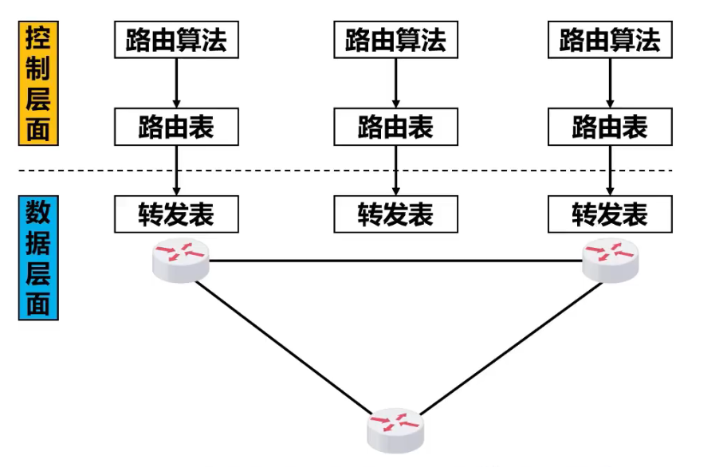
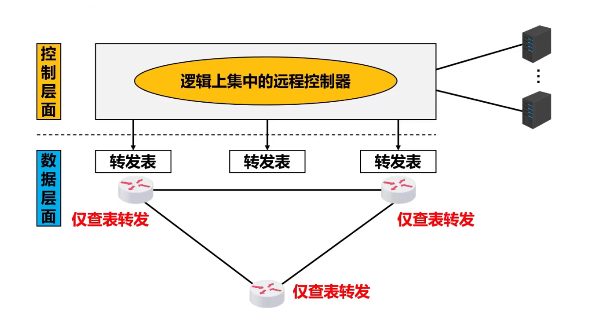
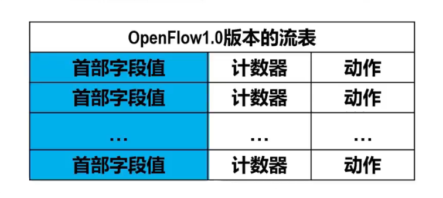
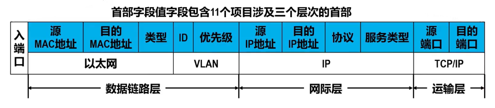
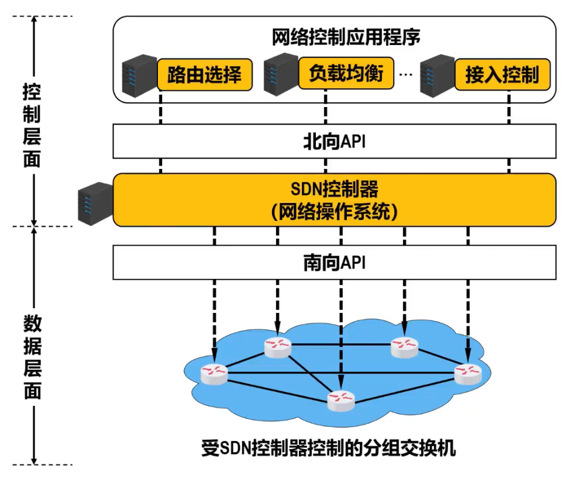
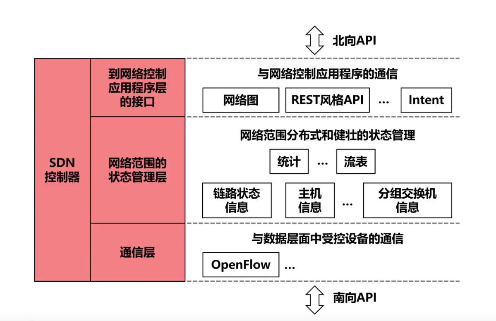

---
---

# SDN

>**Software Defined Network**  
>软件定义网络  
>把网络的控制层面和数据层面分离，让控制层面利用软件来控制数据层面中的设备

## 传统路由网络

路由器的功能：转发和选择

路由器之间传递的信息：分组和路由信息

+ 数据层面任务：转发分组
  + 匹配：查找转发表中的网络前缀，进行最长前缀匹配
  + 动作：把分组从匹配结果指明的接口转发出去

## SDN路由网络

### 定义

OpenFlow：控制层面与数据层面的接口协议

相当于路由器的路由软件不存在了，路由器之间不再交换路由信息

在控制层面，有一个在**逻辑上**集中的远程控制器  
逻辑上集中的远程控制器**在物理上**可有不同地点的多个服务器组成

+ 远程控制器
  + 掌握各主机和整个网络的状态
  + 为每个分组计算最佳路由
  + 为每个路由器生成转发表

#### 广义转发

+ `流`：具有相同特征的分组序列，每个分组共享分组首部某些字段的值，比如有相同的原IP地址
+ 匹配：对网络体系结构中的各层首部的字段进行匹配
+ 动作：不仅可以转发分组，还可以负载均衡，重写IP首部，人为阻挡或丢弃一些分组

在OpenFlow交换机中，既可以处理数据链路层的帧，也可以处理网络层的IP数据报，还可以处理运输层的TCP或UDP报文

### 流表

>**Flow Table**  
>由远程控制器管理  
>每个OpenFlow交换机都有一个或多个流表  
>一个流表可以有多个流表项，一个流表项有三个字段

+ `流表项`：流表的一行
  + `首部字段值（匹配字段）`：用来匹配分组首部的字段  
  
  + `计数器`：与每个流条目关联的一组数据结构
    + `包计数器（Packet Count）`：记录匹配到该流表项的分组数
    + `字节计数器（Byte Count）`：记录匹配到该流表项的分组的总字节数
    + `持续时间（Duration）`：记录匹配到该流表项上次更新到现在经历的时间
  + `动作`：用来指定对匹配到的分组的处理方式
    + 把分组转发到指定端口
    + 丢弃分组
    + 复制分组后从多个端口转发出去
    + 重写分组的首部字段

### 体系结构

+ 特征：
  + 基于流的转发
  + 数据层面与控制层面分离
  + 逻辑上集中的远程控制器
  + 可编程的网络

#### SDN控制器

